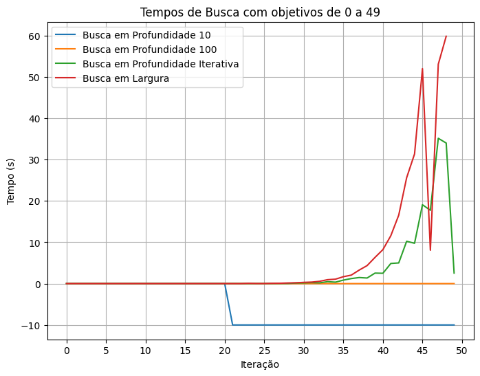
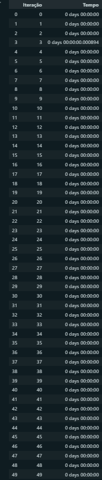
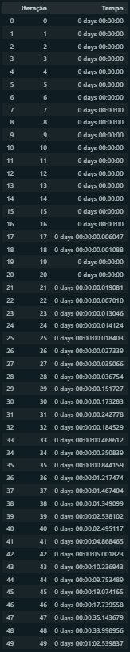
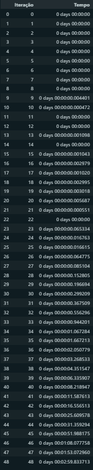

# atividade1_IA
## Gráfico das Buscas

**Segundo o que discutimos em sala de aula, quais destes algoritmos são ótimos? Os resultado encontrados neste exercício são coerentes com está informação? Justifique a sua resposta.**

Os algoritmos considerados ótimos são a busca em largura e a busca em profundidade iterativa. A busca em largura é considerada um algoritmo ótimo quando o custo de cada passo no espaço de busca é uniforme e a solução de menor profundidade é a solução ótima. No entanto, se o espaço de busca for muito grande, a busca em largura pode consumir muita memória e tempo de processamento, tornando-a impraticável em alguns casos, que foi o que ocorreu neste exercício. Por outro lado, a busca em profundidade iterativa é uma combinação das estratégias de busca em profundidade e busca em largura, e é considerada ótima se todas as ações tem o mesmo custo. Neste exercício, o tempo de processamento foi razoável e o resultado encontrado foi o de menor custo. 

**Segundo o que discutimos em sala de aula, quais destes algoritmos são completos? Os resultado encontrados neste exercício são coerentes com está informação? Justifique a sua resposta.**

Os algoritmos considerados completos são a busca em profundidade iterativa e a busca em largura. Os resultados desse exercício indicaram que essas buscas são, de fato, completas, pois o objetivo foi encontrado em todas as iterações.

**Teve algum algoritmo que travou por falta de memória no seu computador? Se sim, qual é a explicação?**

A busca em largura. Essa busca consome uma quantidade significativa de memória, especialmente em espaços de busca extensos ou com fatores de ramificação muito altos. Isso ocorre porque a busca em largura mantém uma lista de todos os nós visitados em cada nível do espaço de busca até encontrar a solução. Se o espaço de busca for muito grande ou infinito a busca em largura pode rapidamente esgotar a memória disponível no computador, e foi o que aconteceu no meu caso com a iteração 50.

**Qual é o algoritmo que tem um tempo de processamento menor? Justifique a sua resposta.**

O algoritmo que teve o menor tempo de processamento foi a busca em profundidade 10. Como a busca em profundidade com limite de profundidade de 10 não precisou explorar até a profundidade máxima, ela realizou menos iterações do loop de busca, o que levou a um tempo de processamento menor em comparação com as outras estratégias. Além de que a partir da iteração 20, não foi possível encontrar solução para a busca uma vez que o objetivo estava a uma profundidade maior do que sua capacidade. No gráfico, o -10 representa o "Não foi possível encontrar solução"

## Tabelas

### Busca em Profundidadde 10

### Busca em Profundidade 100

### Busca em Profundidade iterativa

### Busca em Largura
